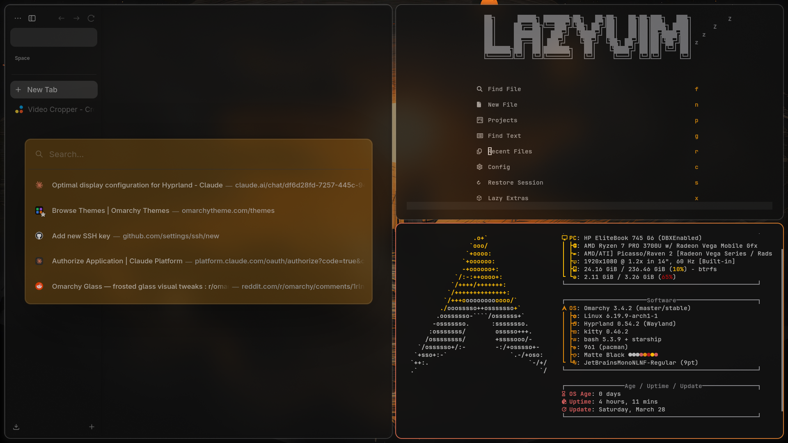
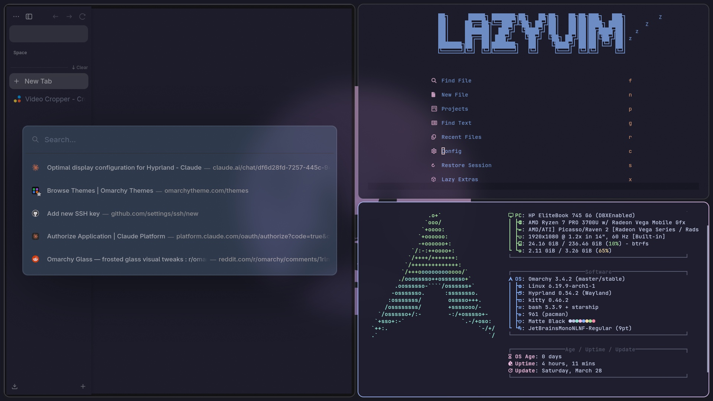
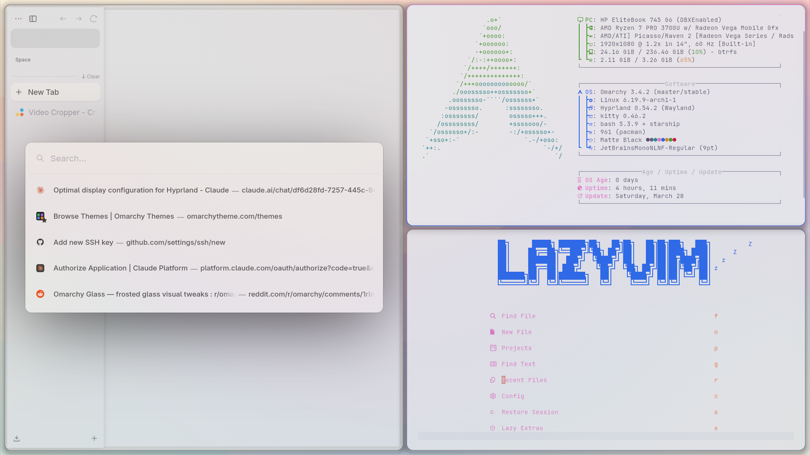

# omarchy-zen

Automatically sync your [Omarchy](https://omarchy.dev) theme to [Zen Browser](https://zen-browser.app). Every time you switch themes in Omarchy, Zen Browser updates instantly to match.

## What it does

- Reads your active Omarchy theme colors from `colors.toml`
- Generates a `userChrome.css` for Zen Browser with matching colors
- Hooks into `omarchy-theme-set-browser` so it runs on every theme switch
- Restarts Zen automatically to apply the new theme

## Preview

> Switch themes in Omarchy → Zen updates automatically

https://github.com/mehexi/omarchy-zen/assets/preview.mp4

## Screenshots





## Requirements

- [Omarchy](https://omarchy.dev) installed and configured
- [Zen Browser](https://zen-browser.app) installed
- Zen launched at least once (to create the profile)

## Installation

```bash
git clone https://github.com/mehexi/omarchy-zen
cd omarchy-zen
bash install.sh
```

Then in Zen Browser, open `about:config` and set:
```
toolkit.legacyUserProfileCustomizations.stylesheets = true
```

Restart Zen and you're done.

## Manual usage

```bash
omarchy-theme-set-zen
```

## What gets themed

- Tab bar background and active tab highlight
- URL bar background, border, and focus color
- URL bar dropdown — active item uses accent color
- Sidebar background
- Toolbar and nav bar
- Titlebar and window borders
- All Zen CSS variables (`--zen-accent-color`, `--zen-colors-*`, etc.)

## How it works

The installer:
1. Auto-detects your active Zen profile from `installs.ini`
2. Writes `omarchy-theme-set-zen` to `~/.local/share/omarchy/bin/`
3. Appends a hook to `omarchy-theme-set-browser` (which Omarchy calls on every theme change)
4. Enables `userChrome.css` support in Zen's `prefs.js`

On each theme switch, the script reads `~/.config/omarchy/current/theme/colors.toml`, generates a fresh `userChrome.css`, and restarts Zen.

## Note on Zen's gradient theme

Zen Browser has a built-in gradient theme generator that sets inline styles via JavaScript — these override CSS variables. For best results, right-click the Zen toolbar → **Edit Theme** and set it to a flat/neutral color. Your Omarchy colors will then show through cleanly.

## Supported Omarchy themes

All built-in Omarchy themes work out of the box:
`catppuccin` · `gruvbox` · `tokyo-night` · `nord` · `rose-pine` · `kanagawa` · `everforest` · `hackerman` · `matte-black` · `miasma` · `ethereal` · `vantablack` · `white` · and more

## License

MIT
